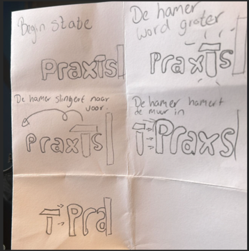
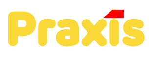
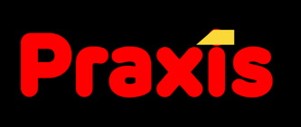
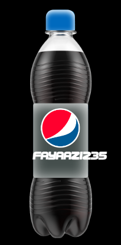
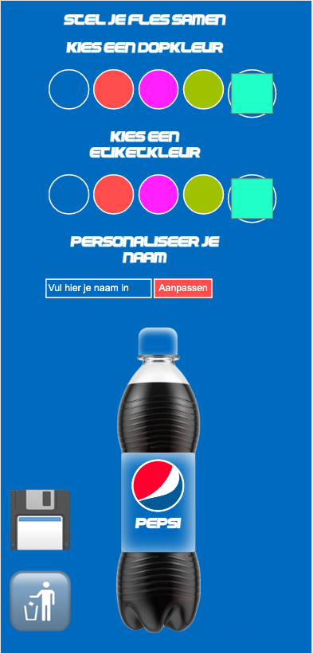
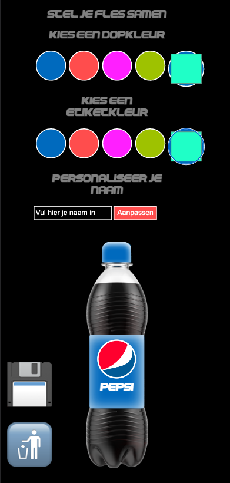

# Procesverslag
**Auteur:** Fayaaz

**De opdrachten:** [opdracht 1](opdracht1/index.html) en [opdracht 2](opdracht2/index.html)

Markdown is een simpele manier om HTML te schrijven.  
Markdown cheat cheet: [Hulp bij het schrijven van Markdown](https://github.com/adam-p/markdown-here/wiki/Markdown-Cheatsheet).

Nb. De standaardstructuur en de spartaanse opmaak van de README.md zijn helemaal prima. Het gaat om de inhoud van je procesverslag. Besteedt de tijd voor pracht en praal aan je website.

Nb. Door *open* toe te voegen aan een *details* element kun je deze standaard open zetten. Fijn om dat steeds voor de relevante stuk(ken) te doen.

## Bronnenlijst
  1. Sanne
  2. https://css-tricks.com/almanac/selectors/a/after-and-before/
  3. https://css-tricks.com/snippets/css/css-box-shadow/
  4. https://www.youtube.com/watch?v=UywDkxwpFKk
5. https://developer.mozilla.org/en-US/docs/Web/HTML/Element/input/color
6. https://www.youtube.com/watch?v=zmJV6VN2h2E html2canvas

## Opdracht 1 plan

  
uitwerken na schetsen idee (voor week 2)

  ### Je storyboard:
  

  ### Je ambitie: 
  Aan deze technieken/punten wil ik werken:
  - de hamer goed vorm geven zonder fotos te gebruiken
  - de animatie vloeiend maken
  - de code logisch maken
 

## Opdracht 1 reflectie

  
uitwerken bij afronden opdracht (voor week 4)

  ### Je uitkomst - karakteristiek screenshot(s):
  

  ### Dit ging goed/Heb ik geleerd: 
  Korte omschrijving met plaatje(s)

  
    De dark mode heb ik toegevoegd met met de custom property, aangeroepen en werkend gemaakt.  

  ### Dit was lastig/Is niet gelukt:
  Korte omschrijving met plaatje(s)

## Opdracht 2 plan

  
Voor opdracht 2 ga ik aan de slag met een Pepsi fles configurator. Hierbij 
kan je verschillende dingen aan de fles aanpassen om het je eigen te maken. 

  ### Je ambitie: 
  Aan deze technieken/punten wil ik werken:
  - Javascript opkrikken en meer begrijpen 
  - Coole functies implementeren
  - 
  - ...

## Opdracht 2 test

  
uitwerken na testen (week 7)

Helaas heb ik niet getest met een klasgenoot. En heb ik zelf wel problemen gevonden die ik zelf niet op kon lossen. hieroder zie je welke dat zijn.

  ### Bevinding 1:
De test van de naam gaat buiten de etiket
  #### oplossing:

  
 

  ### Bevinding 2:
Bij een lege input van de naam komt er een lege ruimte te staan i.p.v pepsi zoals de begin state. 
  #### oplossing:
    <input type="text" name="NaamCustom" class="NaamCustom" placeholder="Vul hier je naam in" required>

## Opdracht 2 reflectie

  
uitwerken bij afronden opdracht (voor week 8)

  ### Je uitkomst - karakteristiek screenshot(s):
  
  
 

  ### Dit ging goed/Heb ik geleerd: 
  Korte omschrijving met plaatje(s)

Ik heb geleerd om met Javascript een screenshot te maken met behulp van Canvas.

        document.getElementById('download').onclick = function (){
        const screenshotTarget = document.getElementById('capture');
            html2canvas(screenshotTarget).then((canvas)=>{
                const base64image = canvas.toDataURL("image/png")
                var anchor = document.createElement('a');
                var Pepsinaam = document.querySelector("input[type=text]").value;
                anchor.setAttribute("href",base64image);
                anchor.setAttribute("download", Pepsinaam + "'s Pepsifles" );
                anchor.click();
                anchor.remove();
            })
        }

Ik heb ook geleerd hoe je met Javascript een colorinput linkt met het veranderen van de kleur van de dop of etiket. 

    let colorPicker;
    const defaultColor = "#1FFFC7";
    let colorPicker1;
    const defaultColor1 = "#1FFFC7";
    
    window.addEventListener("load", startup, false);
    
    function startup() {
    colorPicker = document.querySelector("#color-picker");
    colorPicker.value = defaultColor;
    colorPicker.addEventListener("input", customDop, false);
    colorPicker.select();

    colorPicker1 = document.querySelector("#color-picker1");
    colorPicker1.value = defaultColor1;
    colorPicker1.addEventListener("input", customEtiket, false);
    colorPicker1.select();
    }

    function customDop(event) {
    const d = document.querySelector(".Dop");
    if (d) {
    d.style.backgroundColor = event.target.value;
    }
    }
    
    function customEtiket(event) {
    const e = document.querySelector(".Etiket");
    if (e) {
    e.style.backgroundColor = event.target.value;
    }
    }

  ### Dit was lastig/Is niet gelukt:
Er zijn geen specifieke problemen die ik had, behavle Responsive maken. Omdat de fles zelf een foto is, en de etiket en dop gevormde divjes zijn, kreeg ik de responsiveness niet voorelkaar. 

